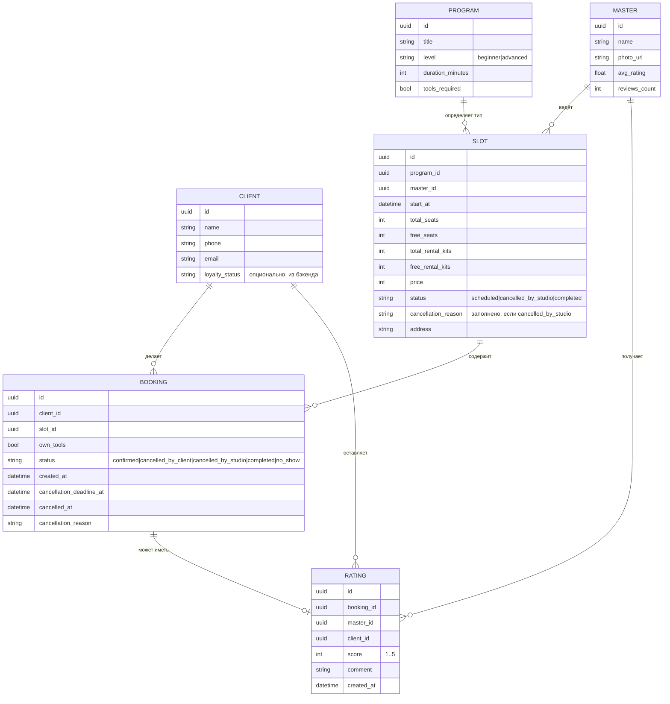

# Схема данных (контрактная модель)

> Важно: это **не схема БД бэкенда** (та вне скоупа, R-004/R-015). Это модель
> сущностей, как их видит и потребляет клиентское приложение через API-контракт —
> та самая «каноническая схема данных = контракт API» (R-015).

## ER-диаграмма

## Комментарии к модели

- **SLOT.free_seats / free_rental_kits** — расчётные поля, приходят от бэкенда;
  приложение не хранит и не пересчитывает их самостоятельно (единый источник
  истины, R-004). Инвариант `free_seats ≤ total_seats`,
  `free_rental_kits ≤ total_rental_kits` обеспечивается на бэкенде.
- **BOOKING.cancellation_deadline_at** — момент времени, после которого отмена со
  стороны клиента недоступна; приходит из API, а не вычисляется в приложении (см.
  открытый вопрос №1 в `customer-questions.md`).
- **BOOKING.status = cancelled_by_studio** — устанавливается бэкендом при
  форс-мажорной отмене слота; вместе с ним заполняется `cancellation_reason`
  (R-008). Такая бронь необратима — повторная запись на этот же слот запрещена
  контрактом (слот в статусе `cancelled_by_studio` не участвует в списке доступных
  для записи).
- **RATING** — связана 1:1 (не более одной) с `BOOKING`, а не напрямую с `MASTER`,
  чтобы гарантировать, что оценку может оставить только клиент, который
  действительно был записан и посетил занятие (`BOOKING.status = completed`).
- **CLIENT.loyalty_status** — опциональное поле; приложение должно корректно
  обрабатывать его отсутствие (см. US-008).
